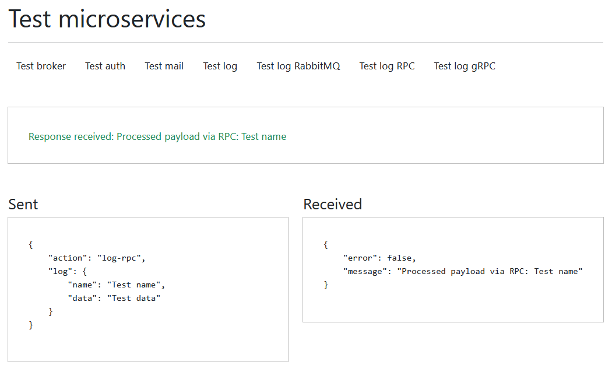

# 🛠️ golang-microservices

A complete microservices-based system built in **Go**, using a powerful combination of **Docker**, **RabbitMQ**, **gRPC**, **MongoDB**, and **PostgreSQL**. This project showcases a scalable, event-driven architecture designed for learning, testing, and demonstrating best practices in backend development.

## 📌 Overview

This project simulates a production-like backend system where multiple microservices communicate via **gRPC**, **RPC**, and **event-driven messaging**. It includes a web frontend for testing interactions and responses from each service, making it ideal for showcasing service orchestration and backend capabilities.

## 🚀 Features

- ✅ Service-to-service communication via gRPC & RPC
- ✅ Event-driven messaging with RabbitMQ
- ✅ Asynchronous tasks using goroutines
- ✅ Email sending simulation with Mailhog
- ✅ Logging service with real-time events
- ✅ Secure authentication workflow
- ✅ Web frontend for interaction testing
- ✅ Automated build and setup with `Makefile`

## 📐 Architecture

```plaintext
+--------------+         +---------------+       +------------------+
| Frontend     | <--->   | Broker Service| <---> | Auth Service     |
| (EJS Web UI) |         |               |       | Mail Service     |
+--------------+         +---------------+       | Logger Service   |
                                           +-->  | Listener Service |
                                           |     +------------------+
                                           |
                                           +-->  [RabbitMQ Queue]
                                                 |
                                                 v
                                        +--------------------+
                                        | MongoDB & Postgres |
                                        +--------------------+
```

* **Direct RPC & gRPC** for efficient internal communication
* **RabbitMQ** for decoupled, async events
* **Databases**: PostgreSQL and MongoDB depending on service

## 🧰 Technologies & Tools

| Tool               | Purpose                                  |
| ------------------ | ---------------------------------------- |
| **Go (Golang)**    | Main language for all backend services   |
| **Docker**         | Containerization of all components       |
| **Docker Compose** | Service orchestration                    |
| **gRPC**           | High-performance communication           |
| **RabbitMQ**       | Event-driven architecture                |
| **MongoDB**        | NoSQL data storage                       |
| **PostgreSQL**     | Relational data storage                  |
| **Mailhog**        | Test email sending functionality         |
| **Makefile**       | Project automation                       |
| **Go-Chi**         | Lightweight HTTP router for the frontend |

## 📦 Microservices Description

### 🔁 Broker Service

* Acts as the entry point
* Routes requests to appropriate services via gRPC or RPC

### 🔐 Auth Service

* Validates user credentials
* Issues authentication tokens

### 📨 Mail Service

* Sends emails asynchronously using goroutines
* Routes messages to Mailhog for testing

### 📝 Logger Service

* Logs requests and events
* Uses MongoDB or PostgreSQL for persistence

### 👂 Listener Service

* Subscribes to RabbitMQ events
* Orchestrates logic based on emitted events

### 🌐 Frontend Service

* Displays EJS templates
* Contains UI for testing the microservice system

## 🧪 How to Run

Make sure you have Docker and Make installed. Then:

```bash
make setup
```

This will:

* Compile all Go binaries
* Start all Docker containers (services, RabbitMQ, DBs, Mailhog)

## 🛑 How to Stop

To shut everything down and remove volumes/networks:

```bash
make setdown
```

## 📸 Interface Preview

> Sample frontend page with buttons to trigger events and view logs:



## 💡 Skills Demonstrated

* Microservices communication patterns (RPC, gRPC, Pub/Sub)
* Event-driven system design
* Asynchronous programming with goroutines
* Authentication flow and token validation
* Real-time logging and monitoring
* Docker orchestration with Compose
* Test-driven backend development
* Integration of frontend with backend services

## 📁 Project Structure

```
golang-microservices/
│
├── auth-service/
├── broker-service/
├── mail-service/
├── logger-service/
├── listener-service/
├── frontend-service/
│   └── templates/
├── docker-compose.yml
├── Makefile
└── docs/images/
```

## 📬 Author

**Douglas Volcato**
[GitHub](https://github.com/douglasvolcato)